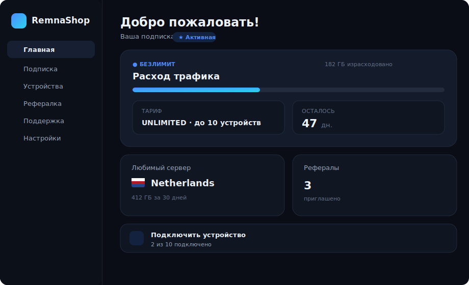
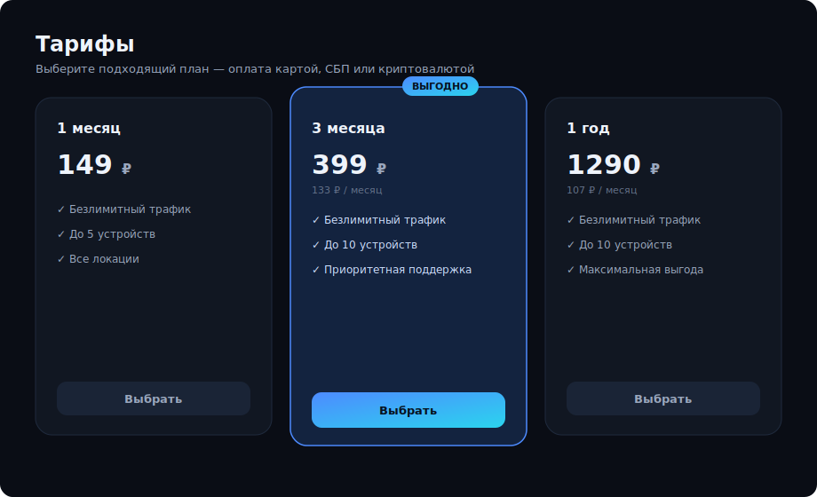
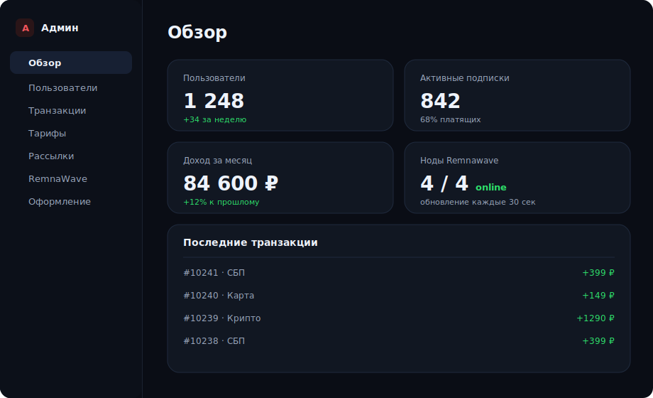
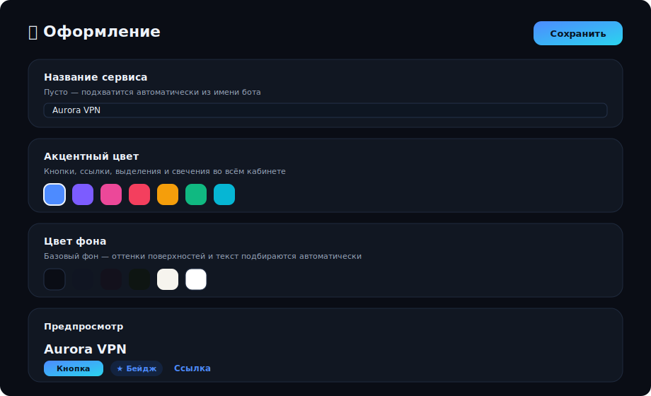

<div align="center">

# 🦛 RemnaShop — веб-кабинет и админка

**Веб-кабинет пользователя и расширенная админ-панель для Telegram-бота
[RemnaShop](https://remnashop.mintlify.app/) на базе [Remnawave](https://remna.st/).**

Ставится одной командой поверх уже работающего бота.

</div>

---

## 📑 Содержание

- [Что это](#-что-это)
- [Скриншоты](#-скриншоты)
- [Возможности](#-возможности)
- [Как устроено](#-как-устроено)
- [Требования](#-требования)
- [Установка](#-установка)
- [Обновление](#-обновление)
- [Порты после установки](#-порты-после-установки)
- [Управление](#-управление)
- [Конфигурация (.env)](#-конфигурация-env)
- [Структура проекта](#-структура-проекта)
- [Безопасность](#-безопасность)
- [Кастомизация (название и цвета)](#-кастомизация-название-и-цвета)
- [Частые вопросы](#-частые-вопросы)

---

## 🎯 Что это

Дополнение к боту RemnaShop, которое добавляет два больших модуля:

| Модуль | Стек | Назначение |
|--------|------|------------|
| **Веб-кабинет** | React + Vite + Tailwind | Личный кабинет пользователя в браузере и как Telegram Mini App |
| **Админка / API** | FastAPI | Управление сервисом из веба — всё, что есть в боте, и больше |

Базовый функционал бота берётся из официального образа
`ghcr.io/snoups/remnashop`. Этот репозиторий **накладывает** сверху свой код —
конфигурацию и данные бота он не меняет.

---

## 📸 Скриншоты

> Демонстрационные данные. Название и цвета настраиваются в админке.

**Кабинет — главная**



**Кабинет — тарифы**



**Админка — обзор**



**Админка — оформление**



### ☀️ Светлая тема

Кабинет поддерживает светлую и тёмную темы (плюс синхронизацию с Telegram).

**Главная**


**Тарифы**


---

## ✨ Возможности

**Веб-кабинет**
- 🔑 Вход через Telegram или по email (с подтверждением кода)
- 📊 Главная: подписка, расход трафика, любимый сервер, рефералы
- 📱 Подключение устройств с deep-link в приложение
- 🎁 Рефералы, тарифы, оплата, баланс
- 🆘 Тикеты поддержки прямо из кабинета
- 🌗 Светлая/тёмная тема, адаптив под мобильный

**Админка**
- 👥 Пользователи и подписки — выдать, продлить, удалить вручную
- 💳 Тарифы, платёжные шлюзы, промокоды, транзакции
- 📣 Рассылки и рекламные ссылки
- 📈 Статистика и состояние нод Remnawave в реальном времени
- 🎫 Общая лента тикетов поддержки

---

## 🏗 Как устроено

Базовый образ бота `ghcr.io/snoups/remnashop` + overlay этого репозитория
(расширенный API и меню) + веб-кабинет (React, отдаётся nginx). Всё запускается
через Docker Compose.

<details>
<summary>Подробная схема (для разработчиков)</summary>

```
┌────────────────────────────────────────────────────────────┐
│  ghcr.io/snoups/remnashop  (базовый образ бота)              │
│        ▲                                                     │
│        │  Dockerfile накладывает admin_src/src/ → /opt/.../src│
│  ┌─────┴───────┐   ┌──────────────┐   ┌────────────────────┐ │
│  │  remnashop  │   │ taskiq worker│   │  taskiq scheduler  │ │
│  │  бот + API  │   └──────────────┘   └────────────────────┘ │
│  │  :5000      │                                             │
│  └─────────────┘   ┌──────────────┐   ┌────────────────────┐ │
│                    │ PostgreSQL   │   │  Valkey (Redis)    │ │
│                    └──────────────┘   └────────────────────┘ │
│  ┌──────────────────────────┐                                │
│  │  cabinet (nginx + React) │  :5002                         │
│  └──────────────────────────┘                                │
└────────────────────────────────────────────────────────────┘
        все сервисы — в docker-сети remnawave-network
```

- **`Dockerfile`** — кладёт `admin_src/src/` поверх образа бота.
- **`cabinet/`** — отдельный multi-stage build (Vite собирает SPA → отдаётся nginx).
- **`docker-compose.yml`** + **`cabinet/docker-compose.cabinet.yml`** — весь стек.
</details>

---

## 📦 Требования

- **Docker** и **Docker Compose** ([как установить](https://docs.docker.com/engine/install/))
- **Уже настроенный и работающий бот RemnaShop** (его `.env` заполнен)
- `openssl` (есть почти везде) — для генерации секретов
- *Только для сценария Б (отдельный сервер):* API бота доступен снаружи по HTTPS
  (в стандартной установке это уже так). Для TLS кабинета — либо свободный порт
  `443` (скрипт предложит поставить Caddy), либо ваш собственный reverse-proxy

### 🖥 Железо для сайт-сервера

Кабинет — лёгкий контейнер (nginx отдаёт статику и проксирует `/api/`). В работе
он потребляет минимум ресурсов; основная нагрузка — разовая **сборка фронтенда
(Vite)**. Чтобы сборка не завершилась ошибкой нехватки памяти, рекомендуется
**2 ГБ RAM**:

| Параметр | Рекомендуется |
|----------|---------------|
| ОС | Ubuntu 22.04+ |
| RAM | **2 ГБ** |
| CPU | 2 vCPU |
| Диск | 15–20 ГБ |
| Канал | зависит от числа пользователей кабинета |

> Через этот сервер проходит только трафик кабинета (статика и проксирование
> API), поэтому высокие требования к каналу и CPU не нужны.

---

## 🚀 Установка

Ставится **одной командой**: Docker, код и зависимости подтянутся сами. Выберите
свой случай — **А** (кабинет на том же сервере, что и бот) или **Б** (кабинет на
отдельной машине).

📦 Репозиторий: **https://github.com/alexdsndr161rus2015-maker/remnashop-cabinet**

> Перед стартом нужен **уже настроенный, работающий бот RemnaShop** (его `.env`
> заполнен). Если бота ещё нет — сначала поднимите его, потом возвращайтесь сюда.

---

### 🅰️ Сценарий А — кабинет на сервере бота (одна машина)

Самый простой путь: бот и кабинет живут вместе.

**Команда (на сервере бота):**

```bash
curl -fsSL https://raw.githubusercontent.com/alexdsndr161rus2015-maker/remnashop-cabinet/main/bot-install.sh | sudo bash
```

**Что у вас спросят (нужно вписать):**

| Поле | Что вписать | Пример |
|------|-------------|--------|
| Username бота | имя вашего бота без `@` | `MyVPN_bot` |
| URL кабинета | где откроется кабинет (с `https://`) | `https://cabinet.example.com` |

**Публикация — автоматически.** Если на сервере уже стоит **Caddy панели
Remnawave** (стандартная раскладка `/opt/remnawave/caddy/Caddyfile` + контейнер
`caddy`), установщик сам впишет туда блок для домена кабинета и перезагрузит
Caddy. Второй Caddy не ставится, TLS на `443` берётся у панели. Вам остаётся
только **A-запись** `cabinet.example.com` → IP сервера.

> Перед правкой делается резервная копия `Caddyfile.bak.*`, повторный запуск не
> дублирует блок. Если Caddy панели не найден (например, у вас **nginx**) —
> установщик покажет готовый блок и для Caddy, и для nginx
> ([см. «Готовые блоки reverse-proxy»](#-готовые-блоки-reverse-proxy-caddy-и-nginx)).

---

### 🅱️ Сценарий Б — кабинет на отдельном сервере (две машины)

Кабинет — на отдельной машине, а к боту он ходит по его публичному API (по
HTTPS). **Здесь два шага — по одному на каждый сервер.**

**Шаг 1 — на сервере БОТА** (добавляем только API для внешнего кабинета, сам
кабинет тут НЕ поднимается):

```bash
curl -fsSL https://raw.githubusercontent.com/alexdsndr161rus2015-maker/remnashop-cabinet/main/bot-install.sh | sudo bash -s -- api
```

| Поле | Что вписать | Пример |
|------|-------------|--------|
| URL кабинета на другой машине | публичный адрес будущего кабинета | `https://cabinet.example.com` |

> Это пропишет адрес кабинета в CORS (`APP_ORIGINS`), чтобы бот принимал запросы
> с него. Никаких новых открытых портов наружу не добавляется — наружу по-прежнему
> смотрит только домен API бота (он уже есть в обычной установке).

**Шаг 2 — на сервере КАБИНЕТА** (чистая машина, ~2 ГБ RAM):

```bash
curl -fsSL https://raw.githubusercontent.com/alexdsndr161rus2015-maker/remnashop-cabinet/main/site-install.sh | sudo bash
```

| Поле | Что вписать | Пример |
|------|-------------|--------|
| Username бота | имя вашего бота без `@` | `MyVPN_bot` |
| Домен API бота | где отвечает `/api/v1/*` бота | `bot.example.com` |
| URL кабинета | публичный адрес этого кабинета | `https://cabinet.example.com` |

**Про HTTPS — делается само, без вопросов:**
- Если порт **443 свободен** — скрипт сам ставит Caddy и выпускает TLS-сертификат.
- Если **443 занят** (у вас уже свой reverse-proxy — Caddy или **nginx**) — скрипт
  его не трогает и показывает готовый блок для вставки на `127.0.0.1:5002`.

> Никакого выбора делать не нужно — установщик сам определяет ситуацию по
> занятости 443. Предпочитаете **nginx** на чистой машине вместо Caddy? Запустите
> с `USE_CADDY=no` — Caddy ставиться не будет, а установщик выдаст готовый
> nginx-блок (см. ниже).

---

### 📋 Готовые блоки reverse-proxy (Caddy и nginx)

Кабинет всегда слушает локально на `127.0.0.1:5002`. Наружу его выводит ваш
reverse-proxy с TLS. Возьмите блок под то, что у вас стоит — заменив
`cabinet.example.com` на свой домен:

**Caddy** (сам выпускает и продлевает сертификат):

```caddy
cabinet.example.com {
    reverse_proxy 127.0.0.1:5002
}
```

**nginx** (сертификат — отдельно, через `certbot`):

```nginx
server {
    listen 443 ssl;
    server_name cabinet.example.com;

    ssl_certificate     /etc/letsencrypt/live/cabinet.example.com/fullchain.pem;
    ssl_certificate_key /etc/letsencrypt/live/cabinet.example.com/privkey.pem;

    location / {
        proxy_pass http://127.0.0.1:5002;
        proxy_set_header Host $host;
        proxy_set_header X-Forwarded-For $proxy_add_x_forwarded_for;
        proxy_set_header X-Forwarded-Proto $scheme;
    }
}
```

> Для nginx сертификат выпустите командой
> `certbot --nginx -d cabinet.example.com` (пакет `certbot` + `python3-certbot-nginx`).
> Caddy делает это сам.

---

### 🔑 Обязательный шаг — привязать домен кабинета к боту в @BotFather

Касается **обоих сценариев**. Чтобы работала кнопка **«Войти через Telegram» в
браузере**, домен кабинета нужно один раз зарегистрировать у бота. Telegram
поменял этот флоу, поэтому есть два варианта — выберите тот, что у вас есть:

**Новые боты (актуально):** [@BotFather](https://t.me/BotFather) → откройте как
mini-app → **Bot Settings → Web Login → Allowed URLs** → добавьте полный адрес
кабинета **с `https://`** — например `https://cabinet.example.com`.

**Старые боты (legacy):** в @BotFather есть команда `/setdomain` → выберите бота →
отправьте домен **без `https://`** — `cabinet.example.com`.

> Без этого шага вход через Telegram **в браузере** не сработает (Telegram не
> отдаёт данные на незарегистрированный домен). Внутри Telegram как **Mini App**
> вход работает и так — там `initData`, привязка домена не нужна. А ещё всегда
> доступен вход **по email**.

**Кабинет поддерживает оба способа входа через Telegram — переключение
автоматическое:**

| Режим | Когда | Что настроить |
|-------|-------|----------------|
| Классический Login Widget (**по умолчанию**) | `TELEGRAM_OIDC_*` пустые | привязать домен (выше). ⚠️ Не включайте необратимый тумблер «чистый OpenID Connect» в Web Login — он ломает классический виджет |
| Новый **OpenID Connect** (опционально) | заданы `TELEGRAM_OIDC_CLIENT_ID` и `TELEGRAM_OIDC_CLIENT_SECRET` | в @BotFather → Bot Settings → **Web Login** взять Client ID/Secret, прописать их в `.env`, а в **Allowed URLs** добавить `https://<домен_кабинета>/api/auth/telegram/oidc/callback` |

> Как только в `.env` появятся `TELEGRAM_OIDC_CLIENT_ID/SECRET`, кабинет сам
> покажет кнопку нового OIDC-входа вместо классического виджета. Пусто — работает
> старый виджет, ничего не меняется. Mini App и email-вход работают в обоих режимах.

---

<details>
<summary>🔧 Ручная установка (без curl) и неинтерактивный Caddy</summary>

```bash
git clone https://github.com/alexdsndr161rus2015-maker/remnashop-cabinet.git
cd remnashop-cabinet
./install.sh         # А: бот + кабинет на одной машине
./install.sh api     # Б, шаг 1: на сервере бота — только API (без кабинета)
./install.sh site    # Б, шаг 2: кабинет на отдельной машине
```

Заранее задать поведение Caddy в `site-install.sh` (без вопроса):
`USE_CADDY=no` — не ставить (у вас свой прокси); `USE_CADDY=yes` — ставить.

Если `.env` бота ещё не заполнен, `bot-install.sh` создаст его из примера и
попросит секреты бота (`BOT_TOKEN`, `REMNAWAVE_*`, `APP_DOMAIN`) — заполните и
запустите ту же команду снова. Конфигурацию бота установщик не меняет.
</details>

---

## 🔄 Обновление

Обновляйте на той же машине той же логикой, что и ставили. `.env` нигде не
перезаписывается — настройки сохраняются.

| Где обновляем | Команда | Что делает |
|---------------|---------|------------|
| **Сервер бота** (сценарии А и Б, шаг 1) — наш код | `cd /opt/remnashop && ./update.sh` | бэкап БД → `git pull` → пересборка |
| **Сервер бота** — базовый образ бота | `cd /opt/remnashop && ./update.sh --base <тег>` | поднимает версию базового образа |
| **Сервер кабинета** (сценарий Б, шаг 2) | повторить команду установки `site-install.sh` | тянет свежий код и пересобирает кабинет |

> Обычная команда `docker compose pull && up` базовый образ бота **не обновит** —
> overlay собирается локально. Подробнее — в [Частых вопросах](#-частые-вопросы).

---

## 🌐 Порты после установки

Сервисы слушают **только на `127.0.0.1`** — наружу их выводит reverse-proxy с TLS.
Новых портов «в интернет» установка кабинета не открывает.

**Сценарий А (одна машина):**

| Сервис  | Локальный адрес  | Наружу публикуете | Назначение |
|---------|------------------|-------------------|------------|
| Бот/API | `127.0.0.1:5000` | домен бота (уже есть) | вебхуки Telegram, API |
| Кабинет | `127.0.0.1:5002` | домен кабинета | веб-кабинет |

**Сценарий Б (две машины):**

| Где | Сервис | Локальный адрес | Наружу публикуете |
|-----|--------|-----------------|-------------------|
| Сервер бота | Бот/API | `127.0.0.1:5000` | домен бота (уже есть) |
| Сервер кабинета | Кабинет | `127.0.0.1:5002` | домен кабинета |

> Кабинет на отдельной машине ходит к боту **по его публичному домену API**
> (HTTPS) — отдельный туннель/WireGuard не нужен.

---

## 🛠 Управление

```bash
# удобный алиас
DC="docker compose -f docker-compose.yml -f cabinet/docker-compose.cabinet.yml"

$DC ps                 # статус контейнеров
$DC logs -f            # логи всех сервисов
$DC logs -f remnashop  # логи только бота/API
$DC up -d              # применить изменения .env
$DC up -d --build      # пересобрать после обновления кода
$DC down               # остановить всё
```

---

## ⚙️ Конфигурация (.env)

Все переменные описаны в [`.env.example`](.env.example) по разделам:

| Раздел | Что внутри |
|--------|------------|
| **Обязательно** | токен бота, домен, Remnawave, username — вводятся вручную |
| **Секреты** | `APP_CRYPT_KEY`, `*_SECRET`, пароль БД — генерируются |
| **Дефолты** | `WEB_ENABLED`, `BOT_MINI_APP*` — разумные значения |
| **Email / SMTP** | необязательно; для регистрации по почте |
| **Добавлено RemnaShop** | блок, который дописывает `install.sh` |

После правки `.env` примените изменения: `docker compose … up -d`.

---

## 📂 Структура проекта

<details>
<summary>Дерево каталогов</summary>

```
.
├── install.sh                      ← установка одной командой
├── docker-compose.yml              ← бот, воркеры, БД, Redis
├── Dockerfile                      ← overlay admin_src на образ бота
├── .env.example                    ← шаблон конфигурации
│
├── admin_src/src/                  ← расширенный API и меню (overlay)
│   ├── web/                        ← FastAPI: публичные и админ-эндпоинты
│   ├── telegram/                   ← кастомное меню бота
│   └── infrastructure/             ← email-отправка, миграции
│
└── cabinet/                        ← веб-кабинет (React + Vite)
    ├── src/pages/                  ← страницы кабинета и админки
    ├── src/components/             ← UI-компоненты
    ├── nginx.conf                  ← прокси /api → бот, SPA-fallback
    └── docker-compose.cabinet.yml  ← сервис кабинета
```
</details>

---

## 🔒 Безопасность

- `.env` с секретами **не коммитится** — он в [`.gitignore`](.gitignore).
- Секреты генерируются криптостойко (`openssl rand`).
- Сервисы доступны только на `127.0.0.1` — наружу через TLS-прокси.
- Админ-доступ — fail-closed: только при явном `is_admin` от бэкенда.

---

## 🎨 Кастомизация (название и цвета)

Оформление меняется **в самом кабинете**, без правки кода:

**Админка → Оформление** (`/admin/appearance`):

| Что | Где применяется |
|-----|-----------------|
| **Название сервиса** | шапка кабинета, экран входа, заголовок вкладки |
| **Акцентный цвет** | кнопки, ссылки, выделения, свечения |
| **Цвет фона** | базовый фон (оттенки поверхностей подбираются сами) |

Есть живой предпросмотр; после «Сохранить» изменения видны всем пользователям.

> **Где это хранится.** Настройки оформления лежат в `assets/branding.json`
> (том `assets`, переживает пересоздание контейнера). Цвет `null` = взять из
> темы. Значение по умолчанию для названия — `RemnaShop`.

Юридические тексты (оферта, правила) на странице «Информация» правятся в коде:
[`cabinet/src/pages/InfoPage.tsx`](cabinet/src/pages/InfoPage.tsx).

---

## 💬 Частые вопросы

**Бот ещё не установлен — что делать?**
Сначала настройте бота RemnaShop (`cp .env.example .env`, заполните раздел
«Обязательно»), затем запустите `./install.sh`.

**Кабинет не открывается у некоторых операторов.**
Кабинет не зависит от внешних доменов на старте. Если домен режут по DPI —
проверьте доступность с включённым VPN; возможно, нужно сменить домен/спрятать за CDN.

**Как обновиться?** См. раздел [🔄 Обновление](#-обновление) выше.

> ⚠️ Стандартная команда `docker compose pull && down && up` здесь **не
> применима** и базовый образ не обновит: overlay бота **собирается локально**
> поверх базового образа (а не загружается из реестра), поэтому требуется
> `--build`, а базовый образ обновляется явно через `--base`. Сообщение «нет
> обновления» относится именно к базовому образу.
