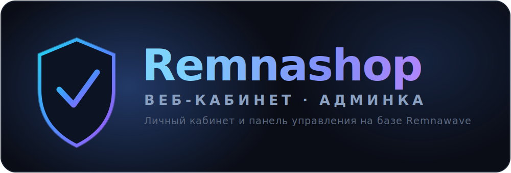

<div align="center">



<br/>
<br/>

# Vela

**Личный кабинет в браузере + удобная админка для Telegram-бота
[RemnaShop](https://remnashop.mintlify.app/).**
Одна команда — и поверх работающего бота появляется сайт-кабинет и панель управления.

<br/>

[](https://github.com/velamaker/remnashop-cabinet/tags)
&nbsp;[](LICENSE)

</div>

---

## Что это простыми словами

У вас уже есть бот RemnaShop, который продаёт VPN в Telegram. **Vela** добавляет к нему две вещи:

- 🌐 **Кабинет** — сайт, где пользователь видит подписку, продлевает её, платит, подключает устройства и пишет в поддержку. Работает и в браузере, и как приложение на телефоне.
- 🛠 **Админку** — панель, где вы управляете всем сервисом: пользователи, тарифы, оплаты, промокоды, рассылки, оформление.

Ставится **поверх** бота и ничего в нём не ломает: конфигурацию и данные бота не трогает.

<div align="center">


</div>

---

## Установка

Нужен **уже работающий бот RemnaShop** (его `.env` заполнен) и **Docker**. Дальше всё скачается и настроится само — скрипт задаст пару вопросов.

Выберите свой случай:

### 🅰️ Кабинет на том же сервере, что и бот

Самый простой вариант. Одна команда на сервере бота:

```bash
curl -fsSL https://raw.githubusercontent.com/velamaker/remnashop-cabinet/main/bot-install.sh | sudo bash
```

Спросит адрес кабинета (например `https://cabinet.example.com`) и способ входа. Сертификат и публикация — автоматически. От вас нужна только DNS-запись `cabinet.example.com` → IP сервера.

### 🅱️ Кабинет на отдельном сервере

Две команды — по одной на каждую машину.

**1. На сервере бота** (открываем боту приём запросов от кабинета):

```bash
curl -fsSL https://raw.githubusercontent.com/velamaker/remnashop-cabinet/main/bot-install.sh | sudo bash -s -- api
```

**2. На чистом сервере кабинета** (хватит 2 ГБ RAM):

```bash
curl -fsSL https://raw.githubusercontent.com/velamaker/remnashop-cabinet/main/site-install.sh | sudo bash
```

Спросит домен API бота и адрес кабинета. HTTPS поднимется сам.

---

## Как входить в кабинет

Вход **по email** работает всегда. Для входа через **Telegram** выберите один способ (установщик подскажет):

<details>
<summary>Telegram-вход — подробнее</summary>

- **OIDC (рекомендуется)** — современный вход. В [@BotFather](https://t.me/BotFather) → ваш бот → **Login Widget** возьмите **Client ID** и **Client Secret**, а в Redirect URI добавьте `https://<домен_кабинета>/api/auth/telegram/oidc/callback`. Установщик пропишет их в `.env`.
- **Классический виджет (устаревший)** — только если OIDC не настроен. Требует `/setdomain` в BotFather (домен без `https://`).
- Внутри Telegram как Mini App вход работает сразу, без настройки.

</details>

---

## Обновление

Той же командой, которой ставили. `.env` не перезаписывается — настройки сохраняются.

| Где | Команда |
|-----|---------|
| Сервер бота (наш код) | `cd /opt/remnashop && ./update.sh` |
| Сервер кабинета | повторить `site-install.sh` |

> Обычный `docker compose pull` базовый образ бота не обновит — он собирается локально. Для базы: `./update.sh --base <тег>`.

---

## Настройка — всё в самой админке

Почти всё меняется мышкой, без правки файлов:

- **Оформление** — название, логотип, цвета.
- **Тарифы, шлюзы, промокоды** — продажи.
- **Рассылки и рекламные ссылки** — маркетинг.
- **Информация** — FAQ, правила, оферта.
- **Статус сервиса, письмо/SMTP, вход через Telegram** — тонкие настройки.

Настройки хранятся в томе `assets/` и переживают перезапуск контейнеров.

---

## Живой пример

Кабинет на боевом VPN: **[cabinet.begemot.cc](https://cabinet.begemot.cc)**

---

<details>
<summary>🔧 Для разработчиков — как устроено, порты, структура</summary>

**Стек:** кабинет — React + Vite + Tailwind (отдаётся nginx); админка/API — FastAPI поверх официального образа `ghcr.io/snoups/remnashop`; всё в Docker Compose (сеть `remnawave-network`).

**Порты** (только на `127.0.0.1`, наружу — через TLS-прокси):

| Сервис | Адрес | Наружу |
|--------|-------|--------|
| Бот/API | `127.0.0.1:5000` | домен бота |
| Кабинет | `127.0.0.1:5002` | домен кабинета |

**Управление:**

```bash
DC="docker compose -f docker-compose.yml -f cabinet/docker-compose.cabinet.yml"
$DC ps            # статус
$DC logs -f       # логи
$DC up -d --build # пересобрать после обновления кода
```

**Структура:**

```
install.sh              ← установка
docker-compose.yml      ← бот, воркеры, БД, Redis
Dockerfile              ← overlay admin_src/ на образ бота
admin_src/src/          ← расширенный API и меню (FastAPI)
cabinet/                ← веб-кабинет (React + Vite, nginx)
```

**Ручная установка (без curl):**

```bash
git clone https://github.com/velamaker/remnashop-cabinet.git
cd remnashop-cabinet
./install.sh        # бот + кабинет на одной машине
./install.sh api    # на сервере бота: только API
./install.sh site   # кабинет на отдельной машине
```

**Безопасность:** `.env` в `.gitignore`, секреты генерируются `openssl rand`, сервисы только на `127.0.0.1`, админ-доступ fail-closed.

</details>

---

## ❤️ Поддержать проект (USDT)

Отправляйте строго в указанной сети, иначе средства можно потерять.

| Сеть | Адрес |
|------|-------|
| **TON** | `UQDg8ZMFH_ei_Dr42Qrrh20mYruaU6wOvfjl34ArjWwN9lpr` |
| **Tron (TRC20)** | `TCEDU7h8MQ4a16R2WD26ne7wFBmV2pXPse` |
| **Ethereum (ERC20)** | `0x1d28281644140CA0ef0309757cE247430ed9B6A7` |
| **Solana (SOL)** | `BnJAvjJNXcDGozYbu29vmCzvWrFMpgvXEmgKRxCV3SMG` |

Спасибо! 🙏
